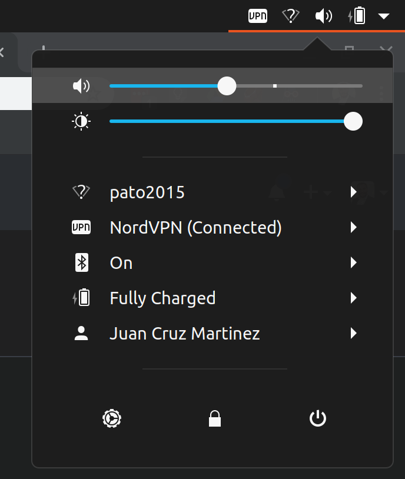
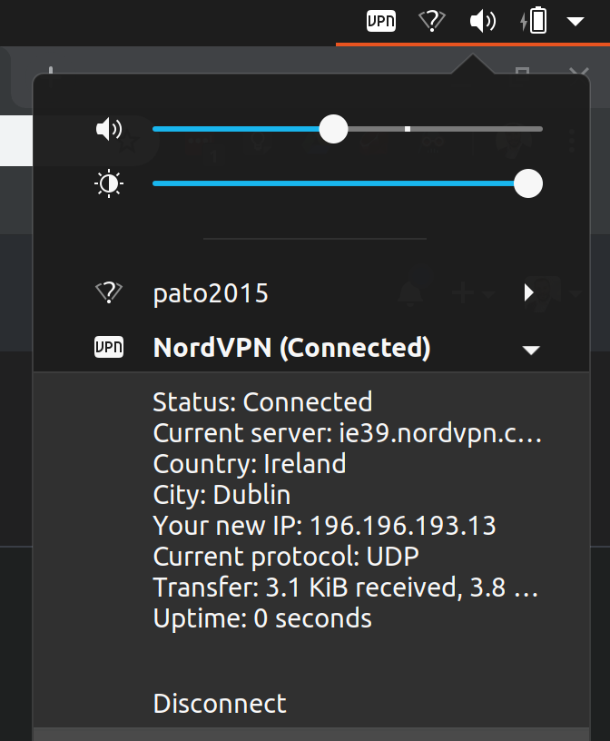

# NordVPN-Status
A Gnome extension that allows the user to monitor and control the status of the NordVPN connection in the top bar.

Source: https://github.com/bajcmartinez/nordvpn-status

## What it does
When connected to a NordVPN a `VPN` icon indicator will be display in the system status indicator area.

|         VPN OFF                |         VPN ON                |      VPN Details       |
:-------------------------:|:-------------------------:|:-------------------------:
|||     |

## What it does
When disconnected, the top bar will show a red button reading `UNPROTECTED`, to remind you that you are not connected to the VPN. When connecting or disconnecting the button turns amber, and once connected it will turn green showing you the country and server number you are connected to, e.g. `UNITED KINGDOM #813`. When you click the button it will show the full command-line output of the command `nordvpn status` in the menu. Undearneath the status is a button that allows you to connect / disconnect.

## How to Install
This extension uses the NordVPN command line client, which can be set up as follows.

### Install NordVPN
1. Install NordVPN with `sudo apt install nordvpn`.
2. Configure your credentials with `nordvpn login`, following the prompts.
3. Check NordVPN is set up with `nordvpn c`, if it connects successfully then you're good to go.

### Install the extension
Easiest way: enable on gnome-extensions at [NordVPN Local on gnome extensions](https://extensions.gnome.org/extension/1879/nordvpn-status/)

Manual install:  
1. Create a folder for the extension with `mkdir ~/.local/share/gnome-shell/extensions/nordvpn_status@jcmartinez.dev/`
2. Copy the files from this repo into that folder
3. Enable the extension using `Tweaks` (if you don't have it, install via `sudo apt install gnome-tweaks`)

### Disclaimer
NordVPN-Status is not an official extension, it's built by me, for my personal use and for those who want to enjoy it!